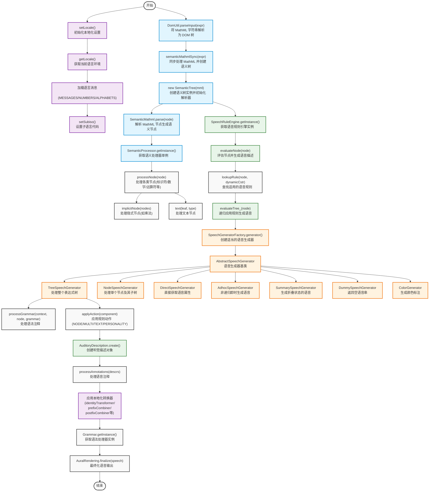

# MathML 到语音字符串的转换流程

本文档展示了 Speech Rule Engine 将 MathML 转换为语音字符串的完整流程。

## 流程图

## 流程说明

1. **输入处理**
   - 将 MathML 字符串解析为 DOM 树
   - 同步处理 MathML 并创建语义树

2. **本地化初始化**
   - 初始化本地化设置
   - 加载语言消息和规则
   - 设置子语言代码

3. **语义处理**
   - 解析 MathML 节点生成语义节点
   - 处理各类节点(标识符/数字/运算符等)
   - 处理隐式节点和文本节点

4. **规则引擎**
   - 获取语音规则引擎实例
   - 评估节点并生成语音描述
   - 查找和应用适用的语音规则

5. **语音生成**
   - 使用不同类型的语音生成器
   - 处理语法注释
   - 应用规则动作

6. **后处理**
   - 创建听觉描述对象
   - 应用本地化转换器
   - 最终化语音输出 