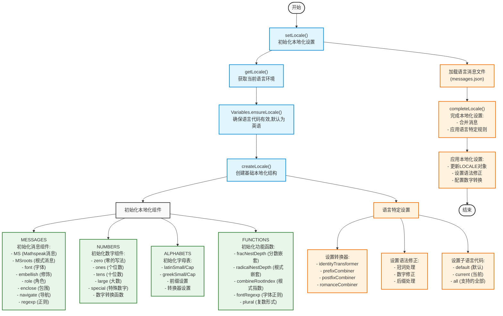
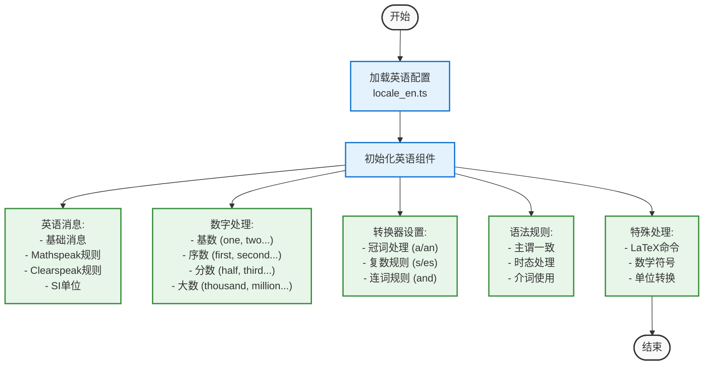
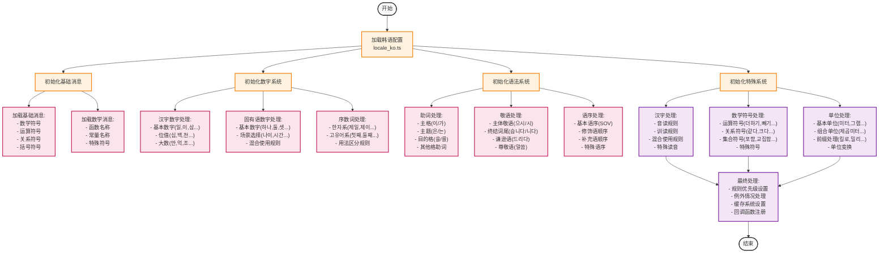
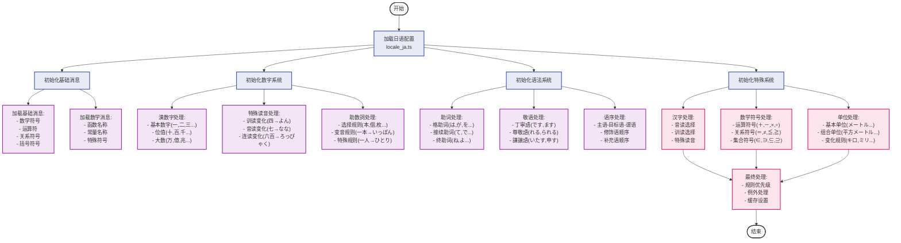
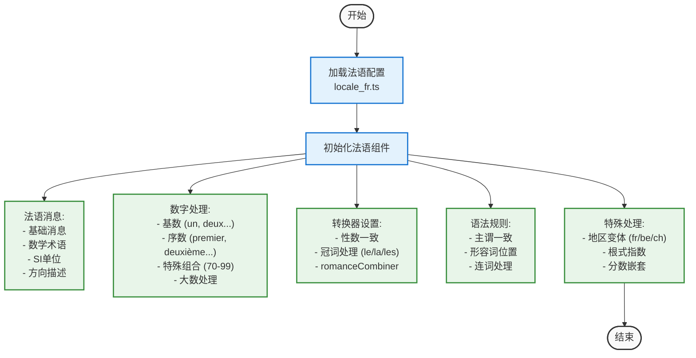
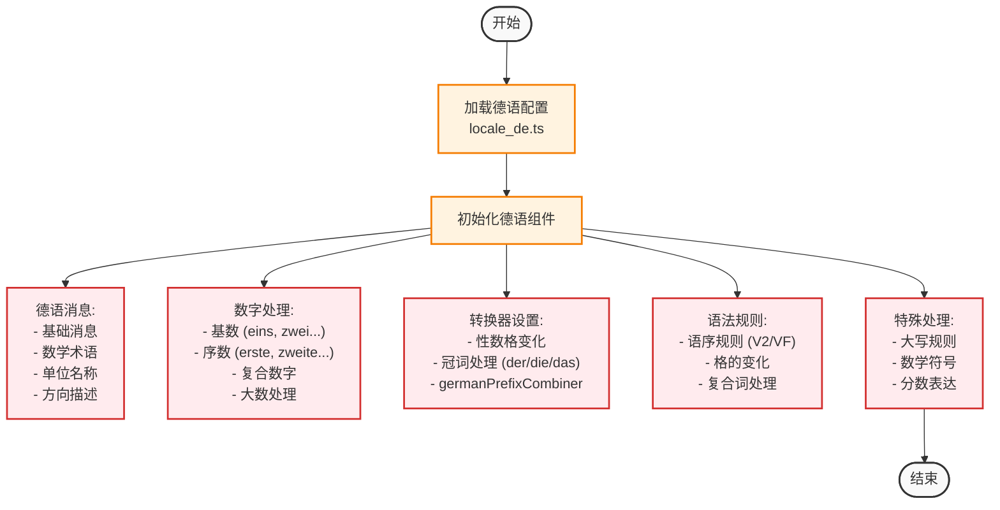
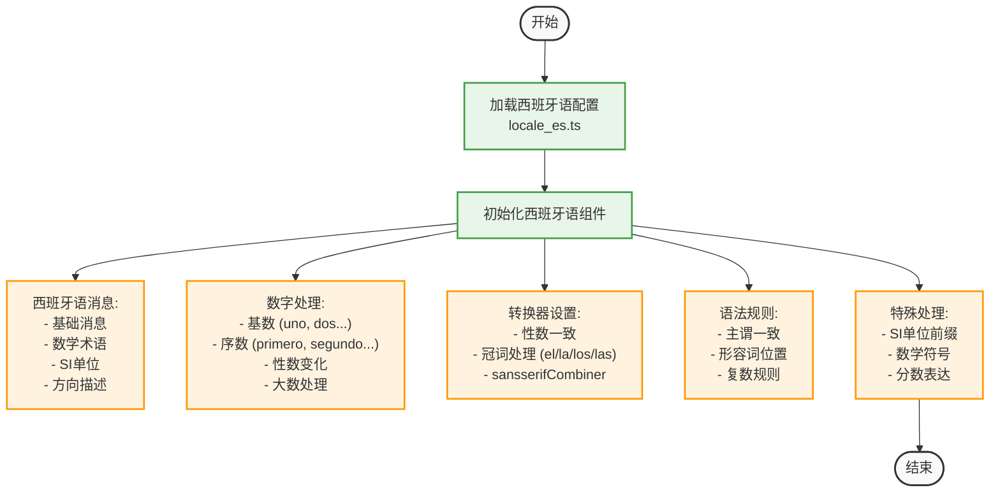
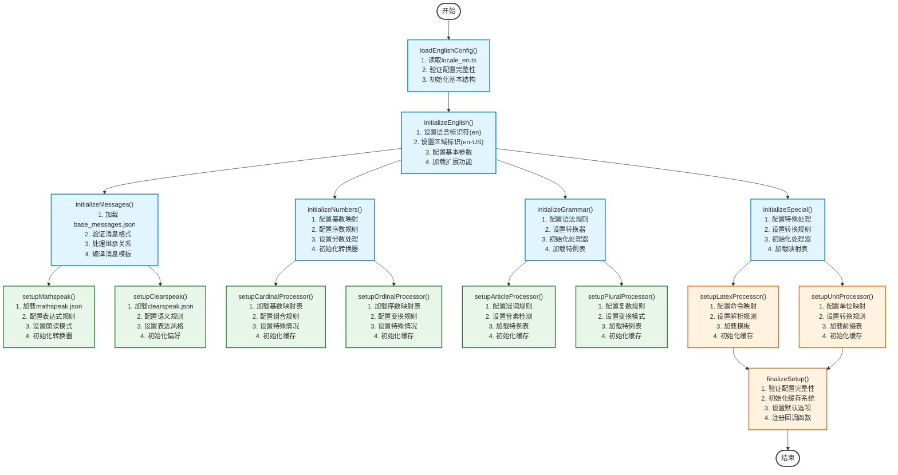

# MathML 国际化(i18n)流程

## 基础流程图

## 英语(en)特定流程

## 韩语(ko)特定流程

## 日语(ja)特定流程

## 法语(fr)特定流程

## 德语(de)特定流程

## 西班牙语(es)特定流程

## 各语言特点总结

### 英语 (en)
- **数字处理**
  - 基本数字到单词的转换 (one, two, three...)
  - 序数生成规则 (first, second, third...)
    - 规则1: 1-19 使用特殊形式 (first, second, third, fourth...)
    - 规则2: 20及以上在基数后加th (twentieth, thirtieth...)
  - 分数读法规则
    - 规则1: 分母1-10使用序数词 (half, third, fourth...)
    - 规则2: 分母>10在基数词后加th (one twentieth, one thirtieth...)
  - 大数处理规则
    - 规则1: 三位一组 (thousand, million, billion...)
    - 规则2: 组合规则 (one hundred and twenty-three thousand...)
- **语法特点**
  - 复数规则
    - 规则1: 一般词尾加's' (cats, dogs...)
    - 规则2: s/sh/ch/x/z结尾加'es' (boxes, dishes...)
    - 规则3: 辅音字母+y结尾，变y为i加es (city→cities)
    - 规则4: 不规则复数 (child→children, foot→feet...)
  - 冠词处理
    - 规则1: 元音音素开头用'an' (an apple, an hour...)
    - 规则2: 辅音音素开头用'a' (a book, a university...)
    - 规则3: 首字母缩写按发音决定 (an MBA, a PhD...)
  - 连词规则
    - 规则1: 并列关系用'and' (x and y)
    - 规则2: 选择关系用'or' (x or y)
    - 规则3: 多项并列最后用and连接 (x, y, and z)
- **特殊处理**
  - LaTeX命令转换规则
    - 规则1: 数学符号转换 (\alpha → "alpha", \beta → "beta"...)
    - 规则2: 运算符转换 (\times → "times", \div → "divided by"...)
  - 数学表达式规则
    - 规则1: 分数读法 ("one half", "three quarters"...)
    - 规则2: 指数读法 ("x squared", "x cubed", "x to the fourth power"...)
    - 规则3: 根式读法 ("square root of", "cube root of"...)
  - 单位转换规则
    - 规则1: SI基本单位 (m → "meters", kg → "kilograms"...)
    - 规则2: SI前缀 (km → "kilometers", mg → "milligrams"...)
    - 规则3: 复合单位 (m/s → "meters per second"...)

### 日语 (ja)
- **数字处理**
  - 汉字数字系统
    - 规则1: 基本数字 (一、二、三...)
    - 规则2: 位值表示 (十、百、千...)
    - 规则3: 大数单位 (万、億、兆...)
  - 特殊读音规则
    - 规则1: 特殊读音数字 (四→よん、七→なな...)
    - 规则2: 位值特殊读音 (八百→はっぴゃく、六百→ろっぴゃく...)
    - 规则3: 连接变音 (一分→いっぷん、三回→さんかい...)
  - 助数詞处理
    - 规则1: 一般助数詞 (個、本、枚...)
    - 规则2: 特殊变音 (一本→いっぽん、三本→さんぼん...)
    - 规则3: 助数詞选择 (細長いもの→本、平たいもの→枚...)
- **语法特点**
  - 助词系统
    - 规则1: 格助词 (は、が、を、に、へ、で...)
    - 规则2: 接続助词 (て、で、から、けど...)
    - 规則3: 副助词 (も、だけ、ばかり...)
  - 敬语系统
    - 规则1: 丁寧語 (です、ます体)
    - 规则2: 尊敬語 (お/ご...になる、られる...)
    - 规则3: 謙譲語 (お/ご...する、いたす...)
  - 语序规则
    - 规则1: 基本语序 (主語-目的語-述語)
    - 规则2: 修飾語順 (連体修飾語は被修飾語の前)
    - 規則3: 補足語順 (時間表現は場所表現の前)
- **特殊处理**
  - 汉字假名変換
    - 規則1: 音読み/訓読み選択
    - 規則2: 送り仮名付加
    - 規則3: 特殊読み処理
  - 数式記号
    - 規則1: 演算子読み (足す、引く、掛ける...)
    - 規則2: 関係演算子 (等しい、より大きい...)
    - 規則3: 集合演算子 (和集合、共通部分...)
  - 単位変換
    - 規則1: SI基本単位 (メートル、キログラム...)
    - 規則2: 接頭辞 (キロ、ミリ、マイクロ...)
    - 規則3: 複合単位 (毎秒メートル、平方メートル...)

### 韩语 (ko)
- **数字处理**
  - 漢字数字系统
    - 规则1: 基本数字 (일, 이, 삼...)
    - 规则2: 位值表示 (십, 백, 천...)
    - 规则3: 大数单位 (만, 억, 조...)
  - 固有韩语数字
    - 规则1: 基本数字 (하나, 둘, 셋...)
    - 规则2: 使用场景 (나이, 시간, 개수...)
    - 规则3: 混合使用规则
  - 序数词处理
    - 规则1: 基本序数词 (첫째, 둘째...)
    - 规则2: 한자系序数词 (제일, 제이...)
    - 规则3: 用法区分
- **语法特点**
  - 助词变化
    - 规则1: 主格助词 (이/가 选择)
    - 规则2: 主题助词 (은/는 选择)
    - 规则3: 目的格助词 (을/를 选择)
  - 语序规则
    - 规则1: 基本语序 (SOV)
    - 规则2: 修饰语顺序
    - 规则3: 补充语顺序
  - 敬语体系
    - 规则1: 格式尊敬 (으시/시)
    - 规则2: 终结词尾 (습니다/니다)
    - 规则3: 谦逊语 (드리다/말씀드리다)
- **特殊处理**
  - 汉字转换
    - 规则1: 音读规则
    - 规则2: 特殊读音
    - 规则3: 混合使用
  - 数学符号
    - 规则1: 基本运算符
    - 规则2: 关系运算符
    - 规则3: 集合符号
  - 单位转换
    - 规则1: 基本单位
    - 规则2: 复合单位
    - 规则3: 前缀处理

### 法语 (fr)
- **数字处理**
  - 基本数字规则
    - 规则1: 基本数字 (un, deux, trois...)
    - 规则2: 11-16特殊形式 (onze, douze, treize...)
    - 规则3: 17-19组合规则 (dix-sept, dix-huit...)
  - 特殊组合规则
    - 规则1: 70-79 (soixante-dix, soixante-et-onze...)
    - 规则2: 80-99 (quatre-vingts, quatre-vingt-un...)
    - 规则3: 连接符使用规则
  - 序数规则
    - 规则1: 第一特殊形式 (premier/première)
    - 规则2: 其他序数规则 (-ième)
    - 规则3: 性数变化
- **语法特点**
  - 性数一致
    - 规则1: 阳性/阴性变化
    - 规则2: 单数/复数变化
    - 规则3: 形容词一致
  - 冠词系统
    - 规则1: 定冠词 (le, la, les)
    - 规则2: 不定冠词 (un, une, des)
    - 规则3: 分词 (du, de la, des)
  - 形容词位置
    - 规则1: 前置形容词
    - 规则2: 后置形容词
    - 规则3: 特殊位置规则
- **特殊处理**
  - 地区变体
    - 规则1: 法国标准
    - 规则2: 比利时变体
    - 规则3: 瑞士变体
  - 数学表达
    - 规则1: 分数表达
    - 规则2: 小数点读法
    - 规则3: 数学符号

### 德语 (de)
- **数字处理**
  - 基数规则
    - 规则1: 基本数字 (eins, zwei, drei...)
    - 规则2: 组合规则 (einundzwanzig, zweiundzwanzig...)
    - 规则3: 大数规则 (hundert, tausend...)
  - 序数规则
    - 规则1: 1-19特殊形式
    - 规则2: 20以上规则形式
    - 规则3: 变化规则
  - 复合数字
    - 规则1: 基本组合规则
    - 规则2: 连接词规则
    - 规则3: 特殊组合
- **语法特点**
  - 格的变化
    - 规则1: 主格规则
    - 规则2: 宾格规则
    - 规则3: 与格规则
    - 规则4: 属格规则
  - 性的变化
    - 规则1: 阳性规则
    - 规则2: 阴性规则
    - 规则3: 中性规则
  - 复合词规则
    - 规则1: 名词组合
    - 规则2: 连接符使用
    - 规则3: 重音规则
- **特殊处理**
  - 大写规则
    - 规则1: 名词大写
    - 规则2: 句首大写
    - 规则3: 特殊情况
  - 数学符号
    - 规则1: 基本运算
    - 规则2: 关系运算
    - 规则3: 集合运算
  - 分数表达
    - 规则1: 简单分数
    - 规则2: 复杂分数
    - 规则3: 混合数

### 西班牙语 (es)
- **数字处理**
  - 基数规则
    - 规则1: 基本数字 (uno, dos, tres...)
    - 规则2: 特殊形式 (dieciséis, veintiuno...)
    - 规则3: 大数规则 (cien/ciento, mil...)
  - 序数规则
    - 规则1: 基本序数 (primero, segundo...)
    - 规则2: 缩写形式 (1º, 2º...)
    - 规则3: 性数变化
  - 数字变化
    - 规则1: 性的变化 (uno/una...)
    - 规则2: 位置变化 (primer/primero...)
    - 规则3: 特殊用法
- **语法特点**
  - 性数一致
    - 规则1: 阳性/阴性
    - 规则2: 单数/复数
    - 规则3: 形容词一致
  - 冠词系统
    - 规则1: 定冠词 (el, la, los, las)
    - 规则2: 不定冠词 (un, una, unos, unas)
    - 规则3: 中性冠词 (lo)
  - 复数规则
    - 规则1: 元音结尾加s
    - 规则2: 辅音结尾加es
    - 规则3: 特殊变化 (z→ces...)
- **特殊处理**
  - SI单位
    - 规则1: 基本单位
    - 规则2: 前缀规则
    - 规则3: 复合单位
  - 数学符号
    - 规则1: 基本运算
    - 规则2: 关系运算
    - 规则3: 集合运算
  - 分数表达
    - 规则1: 简单分数
    - 规则2: 复杂分数
    - 规则3: 混合数

### 共同特点
- **基础结构**
  - 继承机制
    - 规则1: 基础类继承
    - 规则2: 方法重写
    - 规则3: 属性继承
  - 组件系统
    - 规则1: 消息组件
    - 规则2: 功能组件
    - 规则3: 工具组件
  - 转换系统
    - 规则1: 基本转换器
    - 规则2: 组合转换器
    - 规则3: 自定义转换器
- **数学表达**
  - MathML解析
    - 规则1: 节点解析
    - 规则2: 属性处理
    - 规则3: 结构转换
  - 符号本地化
    - 规则1: 基本符号
    - 规则2: 复合符号
    - 规则3: 特殊符号
  - 数学结构
    - 规则1: 分数处理
    - 规则2: 根式处理
    - 规则3: 矩阵处理
- **扩展性**
  - 规则添加
    - 规则1: 新语言添加
    - 规则2: 新规则定义
    - 规则3: 规则覆盖
  - 消息定制
    - 规则1: 消息定义
    - 规则2: 消息覆盖
    - 规则3: 消息继承
  - 规则集支持
    - 规则1: mathspeak规则
    - 规则2: clearspeak规则
    - 规则3: 自定义规则集 

## 语言实现细节流程

### 英语(en)实现流程

### 英语(en)实现说明

1. **初始化阶段**
   - `loadEnglishConfig()`: 加载英语配置文件，验证必要字段，初始化基本结构
   - `initializeEnglish()`: 设置语言标识符，配置区域设置，加载必要扩展

2. **消息系统初始化**
   - `initializeMessages()`: 加载并验证基础消息文件，处理继承关系
   - `setupMathspeak()`: 配置数学表达式的朗读规则和转换器
   - `setupClearspeak()`: 设置自然语言表达的语义规则和偏好

3. **数字处理系统**
   - `initializeNumbers()`: 初始化数字处理系统，配置基本转换规则
   - `setupCardinalProcessor()`: 设置基数处理器，包括映射表和组合规则
   - `setupOrdinalProcessor()`: 配置序数处理器，包括变换规则和特殊情况

4. **语法处理系统**
   - `initializeGrammar()`: 初始化语法规则系统，设置基本处理器
   - `setupArticleProcessor()`: 配置冠词处理器，包括音素检测和特例处理
   - `setupPluralProcessor()`: 设置复数处理器，包括变换规则和特例表

5. **特殊处理系统**
   - `initializeSpecial()`: 初始化特殊处理系统，配置基本转换规则
   - `setupLatexProcessor()`: 设置LaTeX命令处理器，包括映射和解析规则
   - `setupUnitProcessor()`: 配置单位处理器，包括转换规则和前缀处理

6. **完成初始化**
   - `finalizeSetup()`: 验证整体配置，初始化缓存系统，设置默认选项 